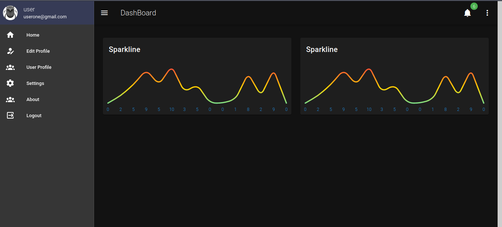

<h3>DashBoard with Laravel-8,inertia.js,vue,vuetify.js</h3>

#installation

composer install

php artisan key:generate

#create database and migrate

php artisan migrate

npm install

npm i @inertiajs/progress &&  vuetify && Toastr && axios

